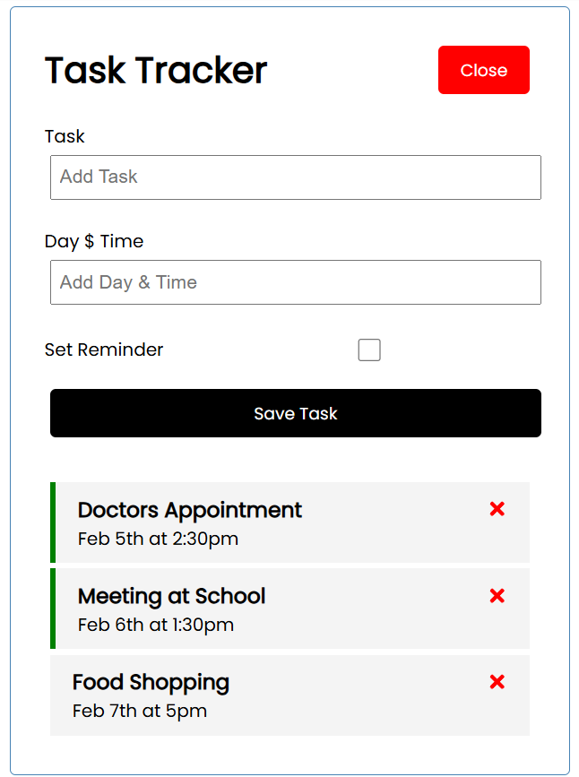

# react-task-tracker
[React JS Crash Course](https://www.youtube.com/watch?v=w7ejDZ8SWv8&t=3663s) - Tutorial (1h48mins) from Brad Traversy 

### `npm run start`

Runs the app in the development mode.\
Open [http://localhost:3000](http://localhost:3000) to view it in your browser.

The page will reload when you make changes.\
You may also see any lint errors in the console.

